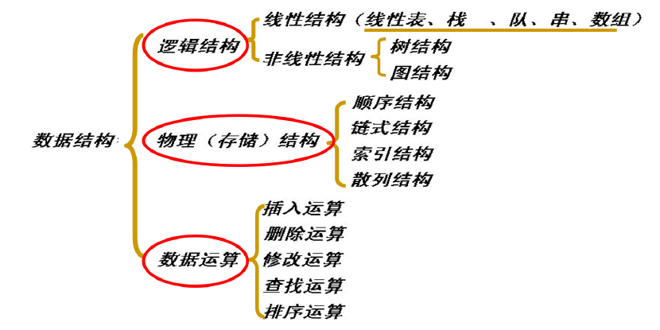
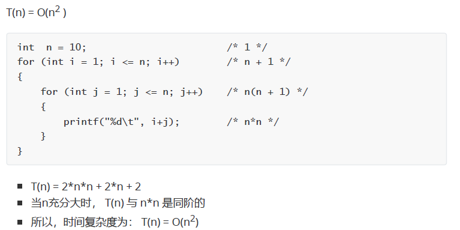
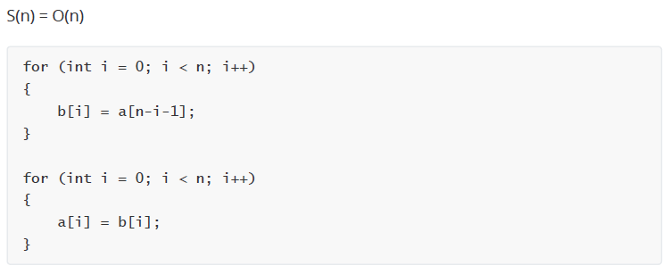
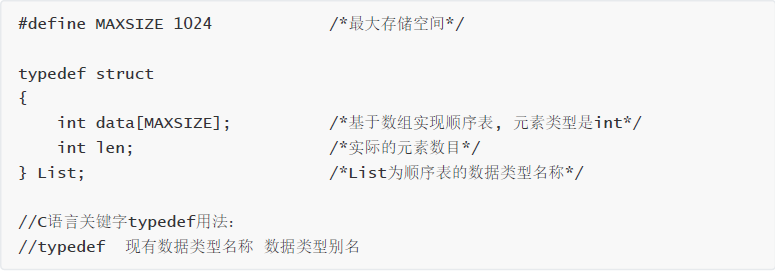

## 学习笔记

高手：
- 强大的内驱
- 极致的态度

思考公司层面的问题。比如日活下降，比如企业发展啥的，然后从技术的角度去赋能  => 三年做到公司的合伙人
【行为背后有动机，外驱型的，改变外部环境，就会改变动机】

工作后的思维方式：需要什么-补什么-学什么-找什么-练什么

#### 01.绪论
- 数据结构与算法：
  - 研究如何**合理组织数据**
  - 研究如何**高效处理数据**

- 数据结构的四类基本结构
  - 集合(1:0)
  - 线性表(1:1)
  - 树(1:n)
  - 图(m:n)

- 思考和学习视角
  - 逻辑结构
  - 物理（存储）结构
  - 数据运算


> 逻辑 -> 物理 -> 运算
> 在考虑架构图的时候，都基本可以按照按照这个视角去思考。数仓的工作也是。

- 算法的评价指标：
  - 正确性、可读性、健壮性
  - 性能（时间复杂度）
  - 存储成本（空间复杂度）
- 时间复杂度
  - O()是渐进符号，也就是“趋势”的意思，时间复杂度只需要看“趋势”而不需要精准的算执行次数
  - 基本语句的执行次数为算法频度，记 T(n) = O(f(n))；
  - 随规模n的增大，算法频度T(n) 和 f(n)的增长率同阶；

  - 结论：算法的时间复杂度跟循环有关系，由**嵌套最深的语句的执行次数**决定

- 空间复杂度
  - 算法所需存储空间的量度，记 S(n) = O(f(n))
  - 随规模n的增大，算法空间S(n) 和 f(n)的增长率同阶；
  - O() 为渐进符号；

> 看程序额外需要多少存储空间


#### 02.顺序表原理和实践
顺序表有怎样的**数据结构**？基于该数据结构如何进行**运算**？顺序表有怎样的**原理和特性**？

- 线性表
  - 线性表是一种**逻辑结构**
  - 线性表中的每一个元素有0个或1个直接**前驱节点**，有0个或1个直接**后继节点**
  - 数据元素是同类型的
  - 线性表在物理上，可以通过**顺序表**和**链表**进行存储表示
- 顺序表
  - 顺序表是一种**物理存储**
  - **逻辑上相邻**的数据元素在**物理上相邻**的存储单元中
  - 顺序表在实践上一般基于**数组**实现
  - loc(ai) = loc(a1) + L * (i-1)
  - 顺序表数据结构

  - 顺序表运算
    - 初始化
    - 插入
- 顺序表总结
  - 优点：可以随机读写任一元素，方便快捷O()
> 数组是编程语言的概念，顺序表是数据结构的概念。换句话说，数组实现了数据结构中的顺序表概念


```
int x, y;
x = 9, y = 3;

int *px, *py; // 声明指针变量
px = &x;      // 给指针变量赋值，取变量x的地址，赋给指针变量px
py = &y; 

printf("%d, %d\n", *px, *py)  // 指针变量的使用， *px 表示指针变量px所指向的变量

```

#### 04 栈原理和实战


##### 循环队列
- 循环队列数据结构
  - 和顺序队列数据结构一致
  - 基于数组实现，逻辑上将数组的首尾连接在一起
  - front指向队头元素，rear指向队尾元素的下一个位置
  - 判断队列为空： front == rear
  - 判断队列为满： (rear+1) % MAXSIZE == front


使用java实现循环队列的两种方式
- 使用used变量 [CircularQueue1](src/main/java/nn2/injava/CircularQueue1.java)
- 单纯只使用 [CircularQueue2](src/main/java/nn2/injava/CircularQueue2.java)