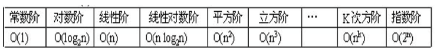

## 学习笔记

### 20210908
高手：
- 强大的内驱
- 极致的态度

思考公司层面的问题。比如日活下降，比如企业发展啥的，然后从技术的角度去赋能  => 三年做到公司的合伙人
【行为背后有动机，外驱型的，改变外部环境，就会改变动机】

#### 01.绪论
- 数据结构与算法：
  - 研究如何**合理组织数据**
  - 研究如何**高效处理数据**

- 数据结构的四类基本结构
  - 集合(1:0)
  - 线性表(1:1)
  - 树(1:n)
  - 图(m:n)

- 思考和学习视角
  - 逻辑结构
  - 物理（存储）结构
  - 数据运算

> 逻辑 -> 物理 -> 运算
> 在考虑架构图的时候，都基本可以按照按照这个视角去思考。数仓的工作也是。

- 算法的评价指标：
  - 正确性、可读性、健壮性
  - 性能（时间复杂度）
  - 存储成本（空间复杂度）
- 时间复杂度
  - O()是渐进符号，也就是“趋势”的意思，时间复杂度只需要看“趋势”而不需要精准的算执行次数
  - 基本语句的执行次数为算法频度，记 T(n) = O(f(n))；
  - 随规模n的增大，算法频度T(n) 和 f(n)的增长率同阶；

  - 结论：算法的时间复杂度跟循环有关系，由**嵌套最深的语句的执行次数**决定

- 空间复杂度
  - 算法所需存储空间的量度，记 S(n) = O(f(n))
  - 随规模n的增大，算法空间S(n) 和 f(n)的增长率同阶；
  - O() 为渐进符号；

> 看程序额外需要多少存储空间

