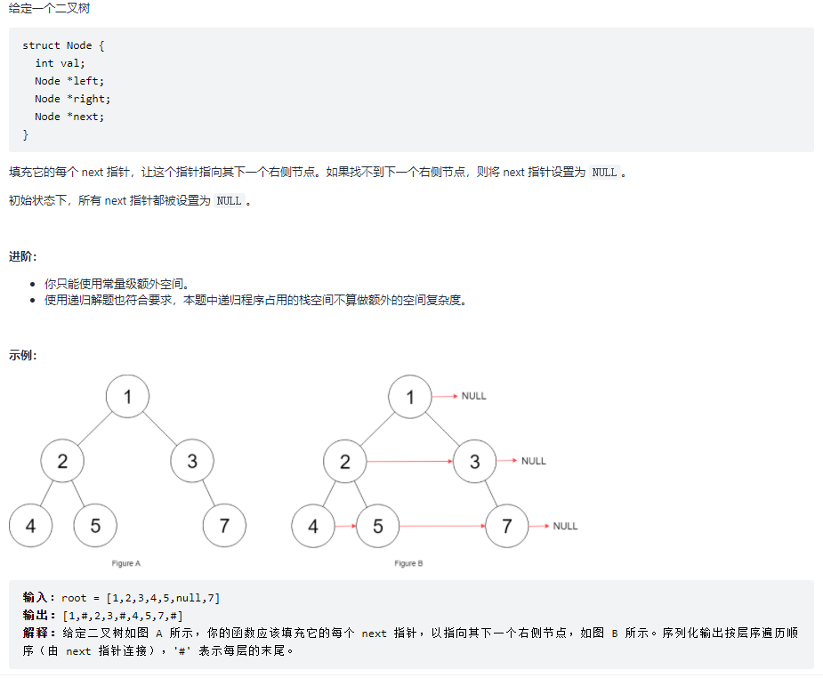

## 数据结构与算法面试宝典 学习笔记

#### 做算法题的方法论
四步分析法：
- 模拟：模拟题目的运行。
- 规律：尝试总结出题目的一般规律和特点。
- 匹配：找到符合这些特点的数据结构与算法。
- 边界：考虑特殊情况。

进一步思考：
- 深度扩展：这种解法是否还能优化
- 广度扩展：这种解法是否有普适性，是否可以推广
## 模块一：数据结构
### 1.简单栈：先进后出，后进先出
栈的特性
```
Stack<Character> t = new Stack<Character>();
t.push('a');
t.push('b');
t.peek(); // 这里得到栈顶元素'b'
t.pop();  // 这里将栈顶元素'b'弹出
t.peek(); // 此时栈顶元素为'a'
t.pop();  // 这里将栈顶元素'a'弹出
```

示例：（参考代码 [StackSolution.java](src/main/java/lagou/model1/StackSolution.java)）
- 示例1：判断字符串括号是否合法
- 示例2：大鱼吃小鱼
- 示例3：找出数组中右边第一个比我小的元素
> TODO: 如何从线性的思维（双重for循环）跳到使用栈的思维？？
- 示例4：字典序最小的 k 个数的子序列
```
【题目】给定一个正整数数组和 k，要求依次取出 k 个数，输出其中数组的一个子序列，需要满足：1. 长度为 k；2.字典序最小。

输入：nums = [3,5,2,6], k = 2
输出：[2,6]

解释：在所有可能的解：{[3,5], [3,2], [3,6], [5,2], [5,6], [2,6]} 中，[2,6] 字典序最小。
```
> 注意这个题目中，子序列要求是“依次”取出的，因此不会出现[2,3]这样的组合，否则这个[2,3]的字典序才是最小的


单调栈
- 有序性：“任何时候都需要保证栈的有序性”
    - 递增栈
    - 递减栈
- 单调栈也是有消除行为的

总结：
- 从示例1到示例4，可以分析从简单栈到单调栈，层层推进的过程中，不停变化就是入栈与出栈的时机。

### 2.队列
```
Queue 中 add() 和 offer()都是用来向队列添加一个元素。
在容量已满的情况下，add() 方法会抛出IllegalStateException异常，offer() 方法只会返回 false 。
```
#### 2.1先入先出队列FIFO
FIFO 有两个点：
- push元素时，总是将元素放到队列的尾部
- pop元素时，总是将队列首部的元素扔掉

题目：
##### 例 1：二叉树的层次遍历（两种方法）
> 当你发现题目具备广度遍历（分层遍历）和顺序输出的特点，就应该想到用FIFO 队列来试一试
- 思考题

- 其他关于层次遍历的变体：[题目及解题思路](https://github.com/lagoueduCol/Algorithm-Dryad/blob/main/02.Queue/README.md)


关于二叉树的边界：遇到空二叉树时，有2种解决思路
- 特殊判断：如果发现是空二叉树，直接返回空结果
- 制定一个规则：不让空指针进入FIFO队列

FIFO 队列不仅可以用 Queue 表示，还可以用两层 ArrayList 来表示，均可达到同样的效果

##### 例2：循环队列
**所有的循环数组下标的处理都需要按照这个取模方法来**
```
index = i 的后一个 (i + 1) % capacity
index = i 的前一个(i - 1 + capacity) % capacity
```

在多线程编程里面，控制变量越少，越容易实现无锁编程，因此，在无锁队列里面，利用方法 2 较容易实现无锁队列。

**使用java实现循环队列的两种方式**
- 方法1：使用used变量 [CircularQueue1](src/main/java/nn2/injava/CircularQueue1.java)
- 方法2：只使用front和rear来实现 [CircularQueue2](src/main/java/nn2/injava/CircularQueue2.java)


#### 2.2 单调队列
单调队列属于双端队列的一种。双端队列与 FIFO 队列的区别在于：
- FIFO 队列只能从尾部添加元素，首部弹出元素；
- 双端队列可以从首尾两端 push/pop 元素。换句话说，双端队列同时具备FIFO和FILO特性

> "单调队列属于双端队列的一种"这句话怎么理解？
>  单调队列为了保持自身的单调性，需要能够从队尾出队，而队列本身也可以从队头出队。因此单调队列会用双端队列来实现。
>  所以准确的说应该是，单调队列是双端队列的一种应用场景。单调队列本身是队列这种数据结构基础上的更高一层的“逻辑封装”（增加了单调性要求）

单调队列在入队的时候，需要满足 2 点：
- 入队前队列已经满足单调性；
- 入队后队列仍然满足单调性。

特别之处：
- 每次入队的时候，为了保证队列的单调性，还要剔除掉尾部的元素。直到尾部的元素大于等于入队元素（因为是单调递减队列）。
- 出队时，需要给出一个 value，如果 value 与队首相等，才能将这个数出队 TODO：为什么?一定要相等
> 之所以要判断 `data.front() == n`，是因为我们想删除的队头元素 n 可能已经被「压扁」了，这时候就不用删除了

单调递减队列最重要的特性是：**入队与出队的组合，可以在 O(1) 时间得到某个区间上的最大值。**
分两种情况讨论：
- 1.只有入队的情况
  - 只有入队，单调队列的覆盖范围会一直增加
  - 队首元素就是覆盖范围的最大值
- 2.有出队和入队的情况
  - 入队，扩张单调队列的覆盖范围
  - 出队，控制单调递减队列的覆盖范围
  - 队首元素就是覆盖范围的最大值
  - 队列中的元素个数小于覆盖范围元素的个数
> 所以对于**单调队列队首元素出队时要判断是否等于n**的最核心理解是：
> 1. 队首元素含义不同：表示覆盖范围的最大值
> 2. 当覆盖的范围内的元素发展变化时（滑动窗口内的元素），对应的队头的也需要相应的变化
> 3. 所以n就是表示滑动窗口滑到下一个元素时需要从窗口出来的元素，而这个元素需要判断是否就是最大值，如果是，就得从单调队列中出队。
> 因为滑到下一个窗口的时候，n已经不在窗口内了，已经无权参加最大值的比较

单调递减有两种：
- 严格单调递减（队列中没有重复元素）
- 单调递减

单调队列的应用场景：求滑动窗口最大值[maxSlidingWindow](src/main/java/lagou/model1/QueueSolution.java#maxSlidingWindow)
> 注意：这里不能使用**严格单调递减队列**！

**单调队列的特性总结**：
- 入队，扩展单调队列的覆盖范围
- 出队，缩小单调队列的覆盖范围
- 队首元素，是覆盖范围的最大值/最小值
- 范围内的最大值，需要用单调递减队列
- 范围内的最小值，需要用单调递增队列

##### 例4：捡金币游戏
这个题目的关键是转为**递归求解**，进而推导出使用**单调队列**

实现代码：[maxResult](src/main/java/lagou/model1/QueueSolution.java#maxResult)

**【小结】** 滑动窗口不一定是在给定的数组上操作，还可能会在一个隐藏的数组上操作

**拓展：是否存在不同的出栈方式？**
- 方式1：通过判断队头是否等于n来决定队头是否出队
- 方式2：入队的时候，把元素的下标和元素一块入队，出栈的时候就只需要判断下标

### 3 优先级队列与堆
通常而言，**优先级队列都是基于堆（Heap）这种数据结构来实现的**。有以下特性：
- 可以 O(lgn) 的复杂度往优先级队列中添加元素；
- 可以 O(lgn) 的复杂度从优先级队列弹出最大/最小元素。


**堆的分类：大堆与小堆**
- 通常堆的结构都是表现为一棵树，如果根比左右子结点都大，那么称为大堆
- 如果根比左右子结点都要小，那么称为**小堆

可以发现堆的特点：**大堆的根是最大值，小堆的根是最小值**

堆的表示：大部分时候都是使用数组表示一个堆，而不是使用二叉树。这是因为:
- 数组的内存具有连续性，访问速度更快；
- 堆结构是一棵完全二叉树。有如下规律： 
  - 结点的父结点 par = (i-1)/2
  - 结点的左子结点 2 * i + 1
  - 结点的右子结点 2 * i + 2

**堆的操作**
- 下沉
- 上浮
- push操作
  - ①往堆的尾巴 a[n] 上添加新来的元素
  - ②新来元素 a[n] 进行上浮的操作
- pop操作
  - ①取出 a[0] 的值作为返回值
  - ②然后将 a[n-1] 存放至 a[0]
  - ③将 a[0] 进行下沉操作

例题：[HeapSolution.java](src/main/java/lagou/model1/HeapSolution.java)
- 例1：前k个高频元素
- 例2：跳跃捡金币游戏
- 例3：加油次数

### 4. 链表
解决链表问题的“三板斧”：假头、新链表、双指针。
#### 假头
参考实现代码：[MyLinkedList.java](src/main/java/lagou/common/MyLinkedList.java)

思考题：如果在链表中进行查找的时候，给定的并不是下标，而是一个数 target，或者是一个结点 ListNode target，应该如何正确地编写这个查找函数呢

参考代码：[ans.java](https://github.com/lagoueduCol/Algorithm-Dryad/blob/main/04.LinkedList/ans.java)

#### 新链表
第二斧就是鬼斧神工，生成新链表后，链表的交换、反转求解都会变得极其简单

#### 双指针
第三斧则是奇思妙想，双指针（也叫快慢指针）用在链表上经常可以解决一些单个指针难以解决的问题

两个指针，一前一后两个指针在链表上前进，有两种：
- 间隔指针：前面的指针先走一步，然后后面的指针再一起走；前面的指针先走 k 步，后面的指针再一起走。
- 快慢指针：两个指针的速度一快一慢前进，比如一个每次走一步，一个每次走两步。

### 5. 树
二叉树的遍历：
- 前序遍历
- 中序遍历
- 后序遍历
- 层次遍历
> 所谓前中后序，指的是根结点的访问顺序

#### 前序遍历
前序遍历的顺序为：
- 遍历根结点
- 左子树
- 右子树

**递归前序遍历**
递归的关键是：写一个递归函数，递归函数里边先访问根节点，再通过递归访问左节点，最后递归访问右节点

**使用栈完成前序遍历**
两层遍历：
- 内层：访问根节点，然后压栈左节点
- 外层：弹栈，并压栈右节点

#### 中序遍历
中序遍历的顺序为：
- 左子树
- 遍历根结点
- 右子树

特点是：访问当前节点的时候，实际上已经知道左边节点的情况了！
而前序遍历是访问当前节点的时候，根本不知道左右子节点的情况。

也就是要注意：中序遍历的**有序性**

**递归中序遍历**
递归函数：先递归左节点，访问根结点，最后递归右节点

**使用栈完成中序遍历**
- 内层循环：不断对结点的左子树压栈
- 外层循环：弹栈，**然后访问结点**，再让右节点按内层循环处理

#### 后序遍历
- 左子树
- 右子树
- 遍历根结点

后序遍历的时候有个特点：想要验证一棵树是否是二叉搜索树，后序遍历的返回值却是整棵树的信息

> tips：使用栈完成后序遍历，不知道外层循环怎么写的时候，自己画个图，模拟走一遍！

#### 层次遍历


## 模块二 算法
### 8.排序
